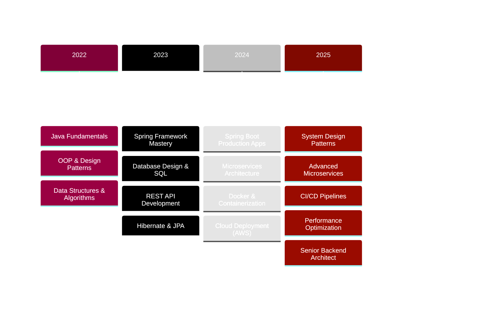

<div align="center">

<!-- Futuristic Glitch Header -->


<!-- Matrix-Style Typing Animation -->


<br/>

<!-- Neon Status Badges -->
<p align="center">
  
  
  
  
</p>


<!-- Social Matrix -->
<table align="center">
  <tr>
    <td>
      <a href="https://www.linkedin.com/in/alaamohamed-javadev">
        
      </a>
    </td>
    <td>
      <a href="mailto:333alaamo@gmail.com">
        
      </a>
    </td>
    <td>
      <a href="https://alaa-portfolio-site1.netlify.app/#/home">
        
      </a>
    </td>
    <td>
      <a href="https://leetcode.com/u/333alaamo/">
        
      </a>
    </td>
  </tr>
</table>


</div>

<br/>

<!-- Neon Divider -->


<br/>

##  SYSTEM INITIALIZATION

<div align="center">

<table>
<tr>
<td>

```ascii
╔══════════════════════════════════════════════════════════════════════════════╗
║                        🚀 BACKEND ENGINEER PROTOCOL                          ║
╠══════════════════════════════════════════════════════════════════════════════╣
║                                                                              ║
║  👤 IDENTITY      : Alaa Mohamed                                             ║
║  💼 DESIGNATION   : Java Backend Engineer                                    ║
║  🌍 LOCATION      : Al Mansurah, Egypt 🇪🇬                                   ║
║  ⏱️  RUNTIME      : 24/7 Problem Solver                                      ║
║  ✅ STATUS        : ACTIVE & AVAILABLE                                       ║
║                                                                              ║
║  🔧 PRIMARY STACK : Java ☕ | Spring Boot 🌱 | SQL 🗃️                        ║
║                                                                              ║
║  🛠️  TECH CONFIGURATION                                                     ║
║     • Backend   : Spring Boot • Hibernate • REST APIs                        ║
║     • Frontend  : Angular • TypeScript • Bootstrap                           ║
║     • Database  : MySQL • Oracle                               ║
║     • Learning  : AWS • Microservices                      ║
║                           ║
║                                                                              ║
║  💡 CORE PHILOSOPHY                                                          ║
║     “Code is not just about making things work—it’s about making            ║
║      them work elegantly, efficiently, and at scale. Build systems          ║
║      that last, APIs that perform, and architectures that endure.” 🚀       ║
║                                                                              ║
╚══════════════════════════════════════════════════════════════════════════════╝
```

</td>
</tr>
</table>

</div>

</div>

<br/>

### ⚡ MISSION CONTROL PANEL

<div align="center">

| 🎯 OPERATION | 📊 STATUS | 💡 DETAILS |
|:-------------|:----------|:-----------|
| **CURRENT_PROJECT** |  | E-Commerce Backend with Advanced Features |
| **EXPERTISE_LEVEL** |  | RESTful APIs, Database Design, System Architecture |
| **LEARNING_PATH** |  | AWS Cloud, Microservices, Spring Security |
| **CODE_QUALITY** |  | SOLID Principles, Clean Architecture, Design Patterns |
| **DEPLOYMENT** |  | Spring Boot Apps in Live Environments |
| **COLLABORATION** |  | Ready for Backend Challenges |

</div>

<br/>


<br/>

## 🛠️ [ TECH MATRIX ]

<div align="center">

### 🔷 CORE BACKEND INFRASTRUCTURE

<table>
  <tr>
    <td align="center" width="140" height="140">
      
      <br/><strong style="color:#00F5FF">JAVA</strong>
      <br/><sub>Core Language</sub>
    </td>
    <td align="center" width="140" height="140">
      
      <br/><strong style="color:#00F5FF">SPRING BOOT</strong>
      <br/><sub>Framework</sub>
    </td>
    <td align="center" width="140" height="140">
      
      <br/><strong style="color:#00F5FF">HIBERNATE</strong>
      <br/><sub>ORM Layer</sub>
    </td>
    <td align="center" width="140" height="140">
      
      <br/><strong style="color:#00F5FF">MYSQL</strong>
      <br/><sub>Database</sub>
    </td>
    <td align="center" width="140" height="140">
      
      <br/><strong style="color:#00F5FF">MAVEN</strong>
      <br/><sub>Build Tool</sub>
    </td>
  </tr>
  <tr>
    <td align="center" width="140" height="140">
      
      <br/><strong style="color:#7B2CBF">POSTMAN</strong>
      <br/><sub>API Testing</sub>
    </td>
    <td align="center" width="140" height="140">
      
      <br/><strong style="color:#7B2CBF">REST API</strong>
      <br/><sub>Architecture</sub>
    </td>
    <td align="center" width="140" height="140">
      
      <br/><strong style="color:#7B2CBF">GIT</strong>
      <br/><sub>Version Control</sub>
    </td>
    <td align="center" width="140" height="140">
      
      <br/><strong style="color:#7B2CBF">GIT</strong>
      <br/><sub>Version Control</sub>
    </td>

<td align="center" width="140" height="140">
  
  <br/><strong style="color:#D30000">JUNIT 5</strong>
  <br/><sub>Testing Framework</sub>
</td>
  
  </tr>
</table>

### 🎨 EXTENDED TECH STACK


### 📊 SKILL DISTRIBUTION

```ascii
Java & Spring Boot    ████████████████████░   95%
Database Design       ███████████████████░░   90%
REST API Development  ███████████████████░░   90%
Frontend Integration  ████████████░░░░░░░░░   60%
```

</div>

<br/>


<br/>

## 🗺️ [ SKILL TREE PROGRESSION ]

<div align="center">




</div>

<br/>


<br/>

## 💼 PROJECT SHOWCASE

<div align="center">

### 🔷 FEATURED SYSTEMS

<table>
  <tr>
    <td width="50%" valign="top">
      <div align="center">
        <h3>🛒 E-COMMERCE BACKEND ENGINE</h3>
        <a href="https://github.com/alaa-333/E-Commerce-REST-API">
          
        </a>
        <br/><br/>
        <p><strong>⚙️ TECH STACK</strong></p>
        
        
        
        
        
        <br/><br/>
        <p align="left">
          ✦ Full-featured RESTful API architecture<br/>
          ✦ JWT authentication & role-based authorization<br/>
          ✦ Advanced order management system<br/>
          ✦ Optimized database queries & transactions<br/>
          ✦ Comprehensive API documentation<br/>
          ✦ Exception handling & validation
        </p>
      </div>
    </td>

  
  </tr>
</table>

</div>

<br/>


<br/>

## 📈 GITHUB ANALYTICS

<div align="center">


</div>


<br/>

## 💎 DEVELOPER PRINCIPLES

<div align="center">

### 🔷 CORE VALUES

<table>
  <tr>
    <td align="center" width="25%">
      <br/>
      <strong>⚡ PERFORMANCE</strong><br/>
      <sub>Optimized queries<br/>Efficient algorithms<br/>Fast response times</sub>
    </td>
    <td align="center" width="25%">
      <br/>
      <strong>🔒 SECURITY</strong><br/>
      <sub>JWT authentication<br/>Data encryption<br/>Secure coding</sub>
    </td>
    <td align="center" width="25%">
      <br/>
      <strong>📐 CLEAN CODE</strong><br/>
      <sub>SOLID principles<br/>Design patterns<br/>Maintainability</sub>
    </td>
    <td align="center" width="25%">
      <br/>
      <strong>🚀 SCALABILITY</strong><br/>
      <sub>Load balancing<br/>Caching layers<br/>Distributed systems</sub>
    </td>
  </tr>
</table>

<br/>

```ascii
╔══════════════════════════════════════════════════════════════════════════════╗
║                                                                                ║
║  "Code is not just about making things work—it's about making them work      ║
║   elegantly, efficiently, and at scale. Every line is a decision, every       ║
║   function is architecture, and every commit is legacy."                      ║
║                                                                                ║
║                                                      — Alaa Mohamed            ║
║                                                                                ║
╚══════════════════════════════════════════════════════════════════════════════╝
```

### 💭 DEVELOPER WISDOM


</div>

<br/>


<br/>

## 🌐 NETWORK PROTOCOLS

<div align="center">


<br/><br/>

### 📡 ESTABLISH CONNECTION

<p>
  <a href="https://www.linkedin.com/in/alaamohamed-javadev">
    
  </a>
  <a href="mailto:333alaamo@gmail.com">
    
  </a>
  <a href="https://alaa-portfolio-site1.netlify.app/#/home">
    
  </a>
  <a href="https://leetcode.com/u/333alaamo/">
    
  </a>
</p>

<br/>


</div>

<br/>


<!-- Glitch Footer -->


</div>
