<div align="center">

<!-- Animated Header -->


<!-- Typing Animation -->


<br/>

<!-- Social Badges with Icons -->
<p align="center">
  <a href="https://www.linkedin.com/in/alaamohamed-javadev">
    
  </a>
  <a href="mailto:333alaamo@gmail.com">
    
  </a>
  <a href="https://alaa-portfolio-site1.netlify.app/#/home">
    
  </a>
</p>

<!-- Profile Views Counter -->


</div>

<br/>

<!-- Wave Separator -->


<br/>

##  About Me - The Backend Engineer
<div  align="center">
<table>
<tr>
<td width="50%" valign="top">

```java
public class AlaaProfile {
    
    private String name = "Alaa Mohamed";
    private String role = "Java Backend Engineer";
    private String location = "Al Mansurah, Egypt 🇪🇬";
    
    private List<String> languages = Arrays.asList(
        "Java ☕", 
        "JavaScript 📜", 
        "SQL 🗃️"
    );
    
    private Map<String, List<String>> expertise = Map.of(
        "Backend", List.of("Spring Boot", "Hibernate", "REST APIs"),
        "Frontend", List.of("Angular", "Bootstrap"),
        "Databases", List.of("MySQL", "Oracle"),
        "Tools", List.of("Maven", "Git", "Postman", "IntelliJ IDEA")
    );
    public String getPhilosophy() {
        return "Clean code isn't written by following rules. " +
               "It's written by professionals with passion. ✨";
    }
}
```

</td>
<td width="50%" valign="center">


</td>
</tr>
</table>
</div>
<br clear="both"/>

### 🎯 Quick Facts

- 🏢 **Current Role:** Backend Developer specializing in enterprise Java applications
- 💼 **Working On:** RESTful APIs, Database optimization, and Spring Boot applications
- 🎓 **Passionate About:** Writing clean, maintainable code and solving complex problems
- ⚡ **Fun Fact:** I debug best at 2 AM with a cup of coffee ☕
- 💬 **Ask Me About:** Java, Spring Boot, REST APIs, Database Design

<br/>


<br/>

##  Tech Arsenal

<div align="center">

### ⚙️ Core Technologies

<table>
  <tr>
    <td align="center" width="140" height="112.43">
      
      <br /><strong>Java</strong>
    </td>
    <td align="center" width="140" height="112.43">
      
      <br /><strong>Spring Boot</strong>
    </td>
    <td align="center" width="140" height="112.43">
      
      <br /><strong>MySQL</strong>
    </td>
    <td align="center" width="140" height="112.43">
      
      <br /><strong>Oracle</strong>
    </td>
    <td align="center" width="140" height="112.43">
      
      <br /><strong>Git</strong>
    </td>
  </tr>
  <tr>
    <td align="center" width="140" height="112.43">
      
      <br /><strong>Hibernate</strong>
    </td>
    <td align="center" width="140" height="112.43">
      
      <br /><strong>Angular</strong>
    </td>
    <td align="center" width="140" height="112.43">
      
      <br /><strong>Postman</strong>
    </td>
    <td align="center" width="140" height="112.43">
      
      <br /><strong>Maven</strong>
    </td>
    <td align="center" width="140" height="112.43">
      
      <br /><strong>REST APIs</strong>
    </td>
  </tr>
</table>


</div>

<br/>


<br/>

<br/>


<br/>

## 🎯 Learning Roadmap - Backend Mastery Path

```mermaid
graph TB
    A[☕ Java Fundamentals] --> B[🏗️ OOP & Design Patterns]
    B --> C[🌱 Spring Framework]
    C --> D[🚀 Spring Boot]
    D --> E[🗃️ Hibernate & JPA]
    E --> F[🌐 REST API Design]
    F --> G{Current Level}
    G --> H[🔒 Spring Security & JWT]
    G --> I[🧩 Microservices Architecture]
    G --> J[☁️ Cloud Deployment - AWS]
    H --> K[⚡ System Design & Scaling]
    I --> K
    J --> K
    K --> L[🎯 Senior Backend Engineer]
    
    style A fill:#ED8B00,stroke:#333,stroke-width:3px
    style B fill:#61DAFB,stroke:#333,stroke-width:3px
    style C fill:#6DB33F,stroke:#333,stroke-width:3px
    style D fill:#6DB33F,stroke:#333,stroke-width:3px
    style E fill:#59666C,stroke:#333,stroke-width:3px
    style F fill:#00D8FF,stroke:#333,stroke-width:3px
    style G fill:#FFD700,stroke:#333,stroke-width:4px,stroke-dasharray: 5 5
    style H fill:#FF6B6B,stroke:#333,stroke-width:3px
    style I fill:#4ECDC4,stroke:#333,stroke-width:3px
    style J fill:#FF9900,stroke:#333,stroke-width:3px
    style K fill:#95E1D3,stroke:#333,stroke-width:3px
    style L fill:#F38181,stroke:#333,stroke-width:4px
```

<div align="center">



### 📚 Current Learning Focus

| 🎓 Technology | 📊 Progress | 🎯 Goal | 🗓️ Timeline |
|:--------------|:------------|:--------|:-----------|
| ☁️ **AWS & Cloud Deployment** | ![60%] | Deploy production apps | Q1 2025 |
| 🔒 **Spring Security & JWT** | ![65%]| Secure all APIs | Q1 2025 |
| 🧩 **Microservices Architecture** |  | Build distributed systems | Q2 2025 |
| ⚡ **System Design & Patterns** |  | Architect scalable solutions | Q2 2025 |

</div>

<br/>


<br/>


<br/>


<br/>

## 💼 Featured Projects - Showcasing Backend Excellence

<div align="center">

<table>
  <tr>
    <td width="55%">
      <h3 align="center">🎯 Task Management System</h3>
      <div align="center">  
        <a href="https://github.com/alaa-333/Task-Management-System" target="_blank">
          
        </a>
        <br/>
        <br/>
        <p><strong>Tech Stack:</strong></p>
        
        
        
      </div>
    </td>
    <td width="45%">
      <h3 align="center">🔥 More Projects Coming Soon</h3>
      <div align="center">
        
        <br/>
        <br/>
        <p><em>Building amazing backend solutions...</em></p>
        <p><strong>Stay tuned! 🚀</strong></p>
      </div>
    </td>
  </tr>
</table>

</div>

<br/>


<br/>

## 📝 Backend Development Insights

<div align="center">

<!-- Dev Quote -->


<br/><br/>

### 💡 My Development Philosophy

<table>
  <tr>
    <td align="center">
      <br/>
      <strong>Clean Code</strong><br/>
      <sub>Write code that humans can read</sub>
    </td>
    <td align="center">
      <br/>
      <strong>Performance</strong><br/>
      <sub>Optimize for speed & efficiency</sub>
    </td>
    <td align="center">
      <br/>
      <strong>Security</strong><br/>
      <sub>Build with safety in mind</sub>
    </td>
    <td align="center">
      <br/>
      <strong>Scalability</strong><br/>
      <sub>Design for growth</sub>
    </td>
  </tr>
</table>

</div>

<br/>


<br/>

## 🤝 Let's Connect & Collaborate

<div align="center">

<p><em>I'm always open to interesting conversations and collaboration opportunities!</em></p>

### 📬 Reach Out To Me

<a href="https://www.linkedin.com/in/alaamohamed-javadev">
  
</a>
<a href="mailto:333alaamo@gmail.com">
  
</a>
<a href="https://alaa-portfolio-site1.netlify.app/#/home">
  
</a>

<br/><br/>

</div>

<br/>


<br/>

<div align="center">

### ⭐ "Code is like humor. When you have to explain it, it's bad." - Cory House

<br/>


<br/><br/>

**Thanks for stopping by! Feel free to explore my repositories and don't forget to ⭐ your favorites!**

<br/>

<!-- Footer Wave -->


</div>
